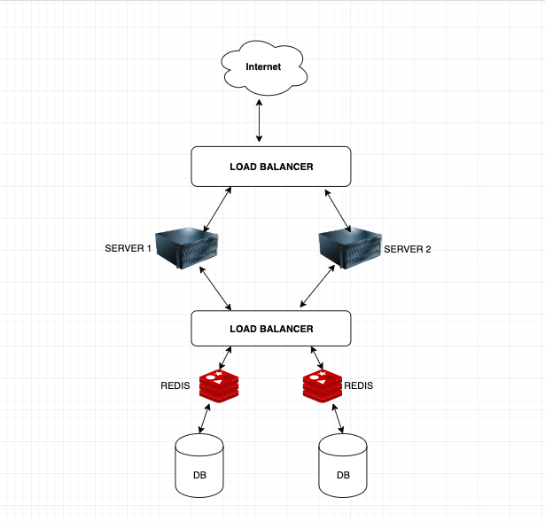

Scaling the application 5X.

1) First we'll try to optimize things that are in our hands(i.e Code, Caching, DB optimization).
    
    > To Do's:
    - Optimizing the code can help greatly in reducing the query time.
    - Also optimizing the static and HTML files so that can load faster everytime one tries to access it.
    - Caching the search result and also caching the most searched movies or most frequently watched movies can
      save a lot of reponse time.
    - Can switch to a NO-SQL DB, which can enable faster access of the data.
    - Try and avoid computation on the server side.
    - And can also reduce the reponse time by enabling the HTTP cache on the browser side, hence avoid regenerating answers the browser already know.

    > Bottlenecks:
    - One server how much ever optimized cannot take the load taken by a distributed set of servers.
    - Also there's a limit to increase the resource of the server.

2) Next comes Vertical scaling.

    > To Do's:
    - Incresing the cores and CPU's.
    - Incresing the RAM of the server.

    > Bottlenecks:
    - Doing the above thing doesn't suffice our purpose hence vertical scaling cannot be useful at all in our pupose.
      Eventually there is a limit to how much we can scale a particular machine or server.

3) Horizontal scaling.

    >To Do's:
    - The goal of scaling is to make our web app do less work for the most common requests.
    - To avoid single point of failure we can have multiple servers that can serve the requests of the users.
    - Adding load balancer with round robin or randmoness to avoid load on a single server.
    - DB sharding and partioning and indexing can play a significant role in reducing the response time.
    - Also storing frequently searched, or the best movies of all time into a REDIS cache can reduce the response 
      time considerablly.
    - We can come to the monitor the performance of our application using some framework using that we can guage improvements.
    - If it says people use it as a more of read heavy application, we can have serprate servers for searching and separate for 
      adding movies to database because that doesn't happen more frequently. This will help in quering the DB faster and since
      the writing is done on different DB there would be lesser load compared to searching.
    - Also, we can use CDN to cater different users from different region hence significantly reducing the load from one stand alone server.
      Using CDN's caching we can cater user requests pretty quick.

    > Bottlenecks:
    - One major bottleneck will be to keep the data uniform in all the Databases.
    - Also a loadbalancer can anyday go down and hence there won't be any connection of the outer world with our servers.
      This can be mitigated by adding a standby Load balancer. But, yes that comes with more cost.
    - And also, Horizontal scaling comes with an additional cost therefore it's going be heavy on our pockets.

Below is an architecture in a Nutshell which can be used to handle.
